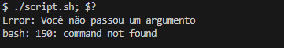

<h2 p align="center" > Variáveis especiais e funções de segurança. </h2>

## Passo 1 - Declarando shebang.

 - Declaramos o <b>shebang bash</b> como padrão para a execução do script.

    - #!/bin/bash

## Passo 2 - Saindo do código após um erro.

 Utilizamos o argumento <b>"set -e"</b> Quando a execução do script encontrar um erro, o script para e aponta o determinado erro. 

    - set -e

## Passo 3 - Constante.

 Por segurança criamos uma constante (apenas leitura), com um valor determinado para a primeira saída da condicional que mostraremos a seguir. 

    - readonly SEM_ARGUMENTOS=150

## Passo 4 - Função de encerramento.

 Criaremos uma função que vai nos ajudar a encerrar o script de uma determinada forma caso suas condições sejam atendidas. 

 A função se resume em cinco etapas internamente, sendo elas:  

A variável <b>msg</b> que vai receber o primeiro valor de input e que depois vai absorver o conteúdo após a função ser evocada, (detalharei mais a seguir na nossa condicional).   

    - msg="${1}"

A variável <b>codigo</b> que vai ser o nosso valor de exit padrão" 

    - codigo="${2:-160}"

Nosso echo contento a string "Error:" que vai fazer concatenar a string que estará após a evocação da função encerrar, utilizando essa string como o primeiro input destinado ao ${1}.  

    - echo "Error: ${msg}"

Caso o código seja interrompido pela função, sua saída no terminal será um STDERR pelo redirecionamento >&2. 

    - echo "Error: ${msg}" >&2

Por último utilizamos o exit para sair do script com o valor de STDERR que determinamos passada pelo valor 160. 

    - exit "${codigo}"

## Passo 5 - Utilizando a função com IF e $#.

 Faremos um simples <b>if elif</b> para determinar as nossas condições de sucesso. 

 Abrindo a condicional perguntaremos se o input do teclado é igual a zero, sendo este <b>"-eq 0"</b> input = 0 ou nenhum input passado. 

    
    - if [[ $# -eq 0 ]]; then

 Caso a nossa condição seja atendida, prosseguiremos para o gatilho do IF, sendo ele a evocação da função <b>encerrar</b> com o texto "Você não passou um argumento" e utilizamos uma substituição do exit ao final evocando a nossa constante "SEM_ARGUMENTOS" com valor de erro de 150. 

    - encerrar "Você não passou um argumento" "${SEM_ARGUMENTOS}"

 Vamos repassar a lógica para ficar mais claro, perguntamos a condicional se foi digitado algo no teclado, utilizando a variável especial <b>$#</b> para reconhecer esta entrada, caso este resultado seja igual a 0 <b>(-eq 0)</b> ou, seja, caso nenhum valor seja passado através do teclado, nós ativaremos a condição do IF. 
 

 A condição em questão é evocar a função encerrar que criamos acima através de seu nome, e ela tem dois built in, <b>echo</b> e <b>exit</b>. A função utilizara como valor de entrada reconhecido dentro da função pelo <b>${msg}</b> a nossa string após a evocação da função, é como se tivéssemos echo <b>"Error: Você não passou um argumento"</b>. 

 Em sequência iremos também substituir o valor padrão do exit pelo nossa constante SEM_ARGUMENTOS, perceba que encapsulamos ambas substituições em suas aspas duplas separadamente. 

 Desta forma teríamos a seguinte saída: 

 Repare que encerramos a primeira instrução de execução do script com <b>";"</b>, e utilizamos a variável especial para ver o tipo de saída, que é 150, como determinado na constante SEM_ARGUMENTOS.

 Caso nossa primeira condição não seja atendida a condicional cai para o elif, que contem o seguinte código.

    - elif [[ $# -gt 1 ]]; then

 Esta condição pergunta se o valor inserido é maior que 1, sendo que valores no linux são separados por padrão com espaço, tab ou pular a linha. 

 Então caso digitássemos dois ou mais valores, teríamos o gatilho ativado, nos destinando a outra mensagem que segue praticamente o mesmo processo acima, suas diferenças são apenas a string de saída e que desta vez não substituímos o STDERR pela constante SEM_ARGUMENTOS, deixando o valor padrão que inserimos dentro da função encerrar na variável ${codigo} que seria 160, como valor de STDERR. 

    - encerrar "Passe apenas um argumento"

 Dentro dessa condicional temos, então, duas possíveis saídas, a primeira passando nenhum argumento ou a segundo passando dois ou mais argumentos. 

 Por fim, quando não atendemos os requisitos da condicional saímos dela e caímos na nossa STDOUT, passando um argumento apenas. 

    - echo "Parabéns, você chegou até a saída utilizando o argumento: ${1}"

 Em resumo, utilizamos o set -e para sair do script caso ele passe por um erro, fizemos uma função de segurança que nos ajuda a sair do script caso determinado erro aconteça, passando padrões definidos por nós. Uma condicional if com duas possíveis saídas de erro, e nossa saída padrão caso evitemos todos os erros. 

