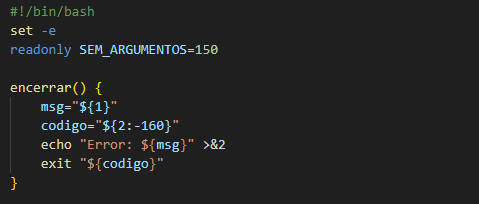
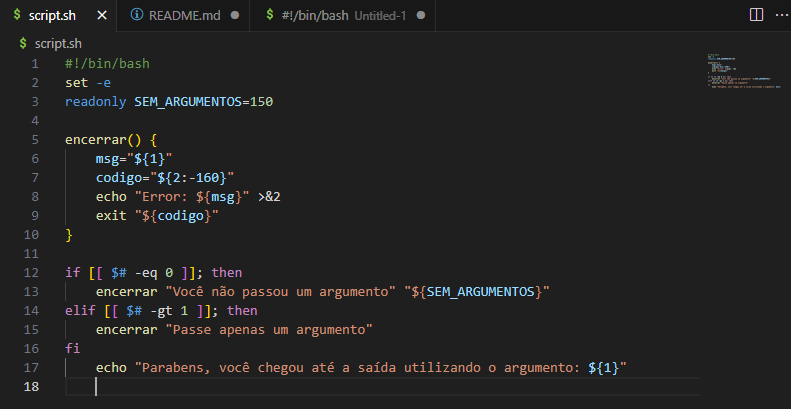
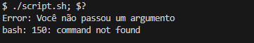
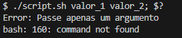
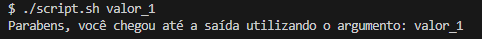

<h3 p align="center" > <i>Forgive me for any grammatical errors, English is not my native language. </i> </h3>

<h2 p align="center" > Special variables and security functions. </h2>

## Step 1 - Declaring a shebang.

 - We declare <b>shebang bash</b> as the default for script execution.

    - #!/bin/bash

## Step 2 - Exiting the code after an error.

 - We use the argument <b>"set -e"</b> When the script execution encounters an error, the script stops and points out the given error. 

    - set -e

## Step 3 - Constant.

 - For safety we create a constant (read only), with a given value for the first output of the conditional that we will show next. 

    - readonly SEM_ARGUMENTOS=150

## Step 4 - Closure function.

 - We will create a function that will help us terminate the script in a certain way if its conditions are met. 

 - The function is summarized in five steps internally, which are: 
 

 - The <b>msg</b> variable that will receive the first input value and then absorb the content after the function is evoked, (I will detail more below in our conditional). 

    - msg="${1}"

 - The variable <b>code</b> will be our default exit value". 

    - codigo="${2:-160}"

 - Our echo contains the string "Error:" which will concatenate the string that will be after the evocation of the function "encerrar", using that string as the first input to ${1}. 

    - echo "Error: ${msg}"

 - If the code is interrupted by the function, its output on the terminal will be a STDERR by redirecting >&2. 

    - echo "Error: ${msg}" >&2

 - Finally we use shell built in exit to exit the script with the value of STDERR that we determined passed by the value 160. 

    - exit "${codigo}"

## Step 5 - Using the function with IF and $#.

 - We will do a simple <b>if-elif</b> to determine our success conditions. 

 - Opening the conditional will ask if the keyboard input is equal to zero, this being <b>"-eq 0"</b> input = 0 or no input inserted. 

    
    - if [[ $# -eq 0 ]]; then

 - If our condition is met, we proceed to the IF trigger, which is the evocation of the <b>"encerrar"</b> function with the text "You did not pass an argument" and we use an exit substitution at the end evoking our constant "SEM_ARGUMENTS" with an error value of 150. 

<i> "Você não passou um argumento" means You did not insert an argument. </i> 

    - encerrar "Você não passou um argumento" "${SEM_ARGUMENTOS}"

 - Let's go over the logic to be clearer, we ask the conditional if something was typed on the keyboard, using the special variable <b>$#</b> to recognize this input, if this result is equal to 0 <b>(-eq 0)</b> or, in other words, if no value is passed through the keyboard, we will activate the IF condition. 
 

 - The condition in question is to evoke the wrap function we created above via its name, and it has two built in, <b>echo</b> and <b>exit</b>. The function will use as input value recognized inside the function by the b>${msg}</b> our string after the function evocation, it is like we have echo <b>"Error: "You did not inserted an argument"</b>. 

 - In sequence we will also replace the default value of exit with our constant SEM_ARGUMENTOS, notice that we encapsulate both replacements in their double quotes separately. 

 - This would give us the following output: 

 - Notice that we end the first script execution statement with <b>";"</b>, and use the special variable to see the output type, which is 150, as determined in the constant SEM_ARGUMENTOS.

 - If our first condition is not met the conditional falls to elif, which contains the following code.

    - elif [[ $# -gt 1 ]]; then

 - This condition asks if the entered value is greater than 1. Values in linux are separated by default with space, tab or skip line. 

 - Then if we entered two or more values, we would have the trigger activated, destining us to another message that follows practically the same process above, its differences are only the output string and that this time we did not replace the STDERR with the constant SEM_ARGUMENTOS, leaving the default value that we entered inside the function "encerrar" in the variable ${codigo} that would be 160, as the value of STDERR. 

 
 <i>"Passe apenas um argumento" means Insert only one argument. </i> 
   
    
    - encerrar "Passe apenas um argumento"

 - Within this conditional we then have two possible outputs, the first passing no arguments or the second passing two or more arguments. 

 - Finally, when we do not meet the requirements of the conditional we exit it and drop into our STDOUT, passing an argument only. 

 <i> "Parabéns, você chegou até a saída utilizando o argumento: means "Congratulations, you made it to the exit using the argument:"    
    
    - echo "Parabéns, você chegou até a saída utilizando o argumento: ${1}"

 - In short, we used the set -e to exit the script if it goes through an error, we made a security function that helps us exit the script if a certain error happens, passing defaults values defined by us. An if conditional with two possible error exits, and our default exit if we avoid all errors. 

